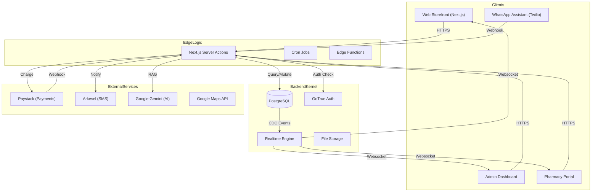
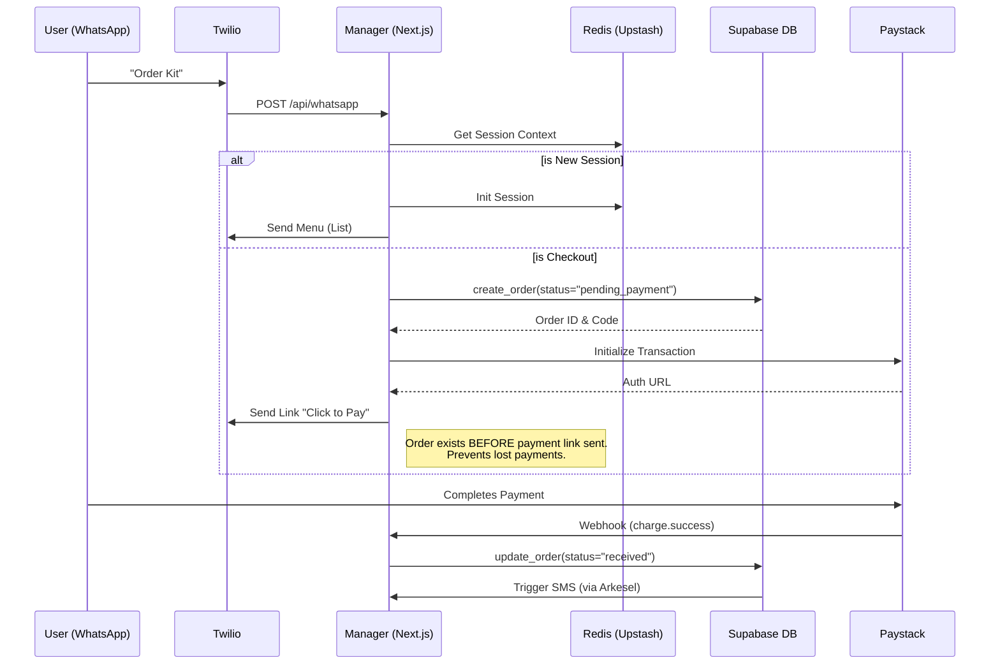
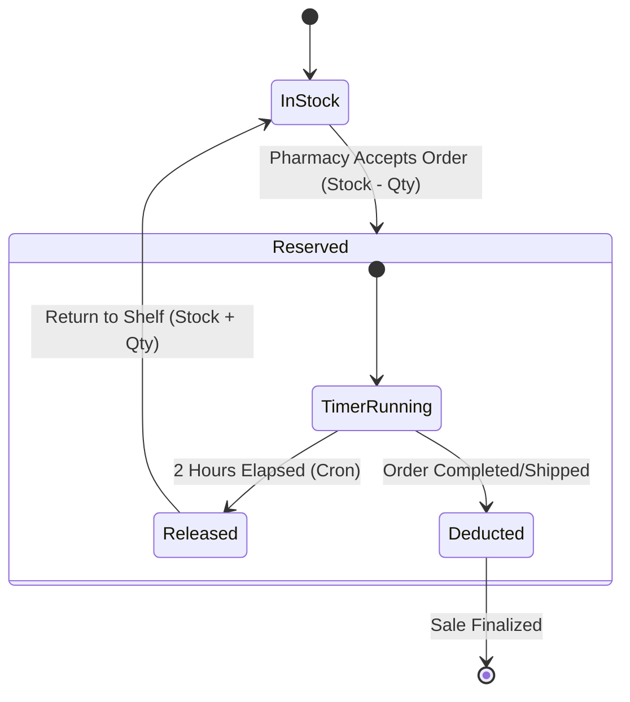

# DiscreetKit System Design

This document outlines the architecture and system design of the DiscreetKit application. It details the core components and how they interact to provide a secure, anonymous, and efficient service.

## 1. Core Principles

The system is designed around these foundational principles:

* **Anonymity:** No user accounts are required. Orders are tracked via unique, non-identifiable codes.
* **Data Minimization:** Only the absolute necessary information for delivery and payment is collected.
* **Security:** All backend operations are handled through secure server-side logic, and payment processing is delegated to a trusted third party.
* **Scalability:** Built on modern, serverless-friendly technologies (Next.js, Supabase, Vercel/Firebase App Hosting).

---

## 2. Architectural Overview

DiscreetKit is a modern web application built on the Jamstack architecture, heavily utilizing the features of Next.js and a "Backend-as-a-Service" (BaaS) provider, Supabase.

### Core Components

1. **Frontend (Next.js App Router)**
2. **Client-Side State Management (Zustand)**
3. **Backend Logic (Next.js Server Actions)**
4. **Database (Supabase)**
5. **Payment Gateway (Paystack)**
6. **AI Chatbot (Genkit & Google Gemini)**
7. **SMS Notifications (Arkesel)**

---

## 3. Component Deep Dive

### 3.1. Frontend

* **Framework:** Next.js 16.0.7 with the App Router. This allows for a hybrid approach of Server Components (for performance and SEO) and Client Components (for interactivity) using the latest React 18+ features.
* **UI Library:** React.
* **Component Toolkit:** `ShadCN UI` is used for pre-built, accessible, and themeable components (Buttons, Cards, Forms, etc.).
* **Styling:** `Tailwind CSS` provides utility-first styling, customized through `globals.css` and `tailwind.config.ts` to maintain a consistent brand identity.
* **Key UI Responsibilities:**
  * Displaying products fetched from the database.
  * Providing an interactive shopping cart experience.
  * Rendering forms for order placement and user input.
  * Displaying real-time order tracking information.

### 3.2. Client-Side State Management

* **Library:** `Zustand`.
* **Purpose:** The `useCart` hook (`src/hooks/use-cart.ts`) manages the entire lifecycle of a user's shopping cart.
* **Functionality:**
  * Adding, removing, and updating the quantity of products.
  * Calculating subtotal, delivery fees, and student discounts.
  * Persisting the cart state to `localStorage`, so a user's cart is not lost if they close the browser.
  * Storing the selected delivery location to apply correct fees and discounts.

### 3.3. Backend Logic

* **Implementation:** All backend logic is encapsulated within **Next.js Server Actions** located in `src/lib/actions.ts`.
* **Security:** This is a critical security feature. Instead of the client making direct requests to the database (which would require exposing sensitive keys), the client invokes a Server Action. This action runs exclusively on the server, where it can safely use admin-level database credentials.

### 3.4. WhatsApp Commerce (Assistant Module)

* **Overview:** A "FAANG-level" conversational commerce system that allows users to browse, order, and track deliveries entirely within WhatsApp.
* **Architecture:**
  * **Manager (`manager.ts`):** The central "Brain" handling message routing, state transitions, and business logic.
  * **Service (`service.ts`):** Wraps the Twilio WhatsApp API for message delivery.
  * **Session (`session.ts`):** Manages user state (Cart, Last Interaction, Current Menu) using **Upstash Redis** with a 24h TTL.
* **Key Innovations:**
  * **Virtual Buttons:** To bypass Twilio Trial limitations (which block interactive buttons), the system renders numbered lists (e.g., "1. View Products") and maps user input (e.g., "1") back to specific action IDs.
  * **Ghost-Order Prevention:** When a user checks out, a `pending_payment` order is created in Supabase *before* generating the Paystack link. This ensures the webhook can always find the order to update, preventing "orphan" payments.
  * **Partner Care Portal:** A gated menu for partners to access exclusive services using a specialized access code.

### 3.5. Pharmacy & Inventory System

* **Overview:** A real-time system for assigning orders to pharmacies, tracking stock, and facilitating communication.
* **Components:**
  * **Inventory Reservations:** When a pharmacy accepts an order, stock is automatically reserved. If not dispatched within 2 hours, a Cron job (`/api/cron/release-reservations`) releases the stock back to the pharmacy.
  * **Auto-Deduction:** Stock is permanently deducted when an order is completed.
  * **Communication:** A real-time chat system (`order_messages`) allows Admins and Pharmacies to communicate within the context of a specific order.
  * **Notifications:** Pharmacies receive SMS notifications for new assigned orders via `pharmacy_notifications`.
  * **Escalations & Admin Alerts:** A scheduled job (`/api/cron/check-escalations`) runs every 15 minutes to detect stuck orders and sends SMS alerts to admin contacts (`ADMIN_PHONES`).

### 3.6. Payment Gateway (Paystack)

* **Role:** Securely handles all payment processing (Mobile Money, Card).
* **Flow:**
    1. The `createOrderAction` server action sends a request to the Paystack API to initialize a transaction, passing the total amount and order reference code.
    2. Paystack returns a secure `authorization_url`.
    3. The user's browser is redirected to this URL to complete payment on Paystack's hosted page.
    4. Upon completion, Paystack sends a server-to-server notification (webhook) to our application's webhook handler.
* **Webhook (`src/api/webhooks/paystack/route.ts`):**
  * A dedicated API route that listens for `charge.success` events from Paystack.
  * It cryptographically verifies the webhook signature to ensure it's genuinely from Paystack.
  * Upon successful verification, it updates the order status in the Supabase database (e.g., from `pending_payment` to `received`) and logs a payment confirmation event in `order_events`.

## Payment Reliability and Verification Fallback

To ensure orders transition out of `pending_payment` even if Paystack webhooks are delayed or misconfigured, the system includes a verification fallback triggered on the user's return to the site:

1. Order creation via `createOrderAction` inserts the order with status `pending_payment` and initializes a Paystack transaction using the order `code` as the Paystack `reference`.
2. Primary path: Paystack calls our webhook `POST /api/webhooks/paystack`. On `charge.success` with `data.status === 'success'`, we update `orders.status` to `received` (idempotent) and append an `order_events` "Payment Confirmed" entry.
3. Fallback path: When Paystack redirects the user to `/order/success?reference=...`, the page calls `GET /api/payment/verify?reference=...`. The server verifies the transaction with Paystack's Verify API and, if successful and the order is still `pending_payment`, updates it to `received` and appends the same event. This endpoint is idempotent and safe to retry.
4. Live updates: The client tracking page subscribes to `orders` updates via Supabase Realtime and refetches the order; the admin dashboard receives an SSE event and refetches metrics and recent orders.

### Configuration Checklist

* `PAYSTACK_SECRET_KEY` must be set for both initializing and verifying transactions.
* Paystack webhook URL should be configured to: `https://<your-domain>/api/webhooks/paystack`.
* `NEXT_PUBLIC_SITE_URL` must point to the public base URL used in Paystack callback URLs.
* Supabase Realtime must be enabled for the `orders` table to support live UI updates.

### Test Steps

1. Place an order and complete a Paystack test payment.
2. After redirect to `/order/success?reference=...`, the page will call the verify endpoint.
3. Visit `/track?code=<reference>` and confirm status is `received` with a "Payment Confirmed" event.
4. Open the admin dashboard; the order should appear in recent orders (pending payments are filtered out).

### Operational Hardening

* Verify endpoint `/api/payment/verify` has a lightweight per-IP+reference rate limit (5 requests/min) to reduce abuse. This is an in-memory limit and acts per instance in serverless.
* Enable debug logs by setting `PAYMENTS_DEBUG=true` to emit safe, structured messages from both webhook and verify paths. Keep it off in production unless troubleshooting.
* Security headers are set via Next.js `headers()` (HSTS, X-Content-Type-Options, Referrer-Policy, Permissions-Policy, X-Frame-Options). Adjust as needed based on embedding or third-party requirements.

### Scheduled Operations (2026-02)

* **15-minute cadence:** Escalation checks and reservation releases with concurrency guards and retry logic.
* **Daily cadence (05:00 UTC):** Payment reconciliation batch verification to advance stuck `pending_payment` orders.
* **Auth & secrets:** Bearer headers (`Authorization` or `x-cron-key`) validated against `CRON_SECRET` with sanitized comparisons.
* **Testability:** Admin SMS test endpoint enables quick validation of alert delivery without mutating production orders.

### Scheduled Reconciliation

* Endpoint: `GET /api/payments/reconcile` (Node runtime)
* Purpose: Re-verify orders stuck in `pending_payment` beyond a threshold (default 10 minutes) using the Paystack Verify API.
* Auth: Provide either `X-CRON-KEY: <CRON_SECRET>` header or `?secret=<CRON_SECRET>` query param. If `CRON_SECRET` is not set, calls with the `X-Vercel-Cron` header (from Vercel Cron) are allowed.
* Idempotency: Updates only if the order is still `pending_payment` and appends a standard "Payment Confirmed" event.
* Scheduling: Configured via `vercel.json` crons (default every 10 minutes). You may adjust the cadence in the Vercel dashboard.

### Distributed Rate Limiting (Optional)

* If `UPSTASH_REDIS_REST_URL` and `UPSTASH_REDIS_REST_TOKEN` are set, the app uses an Upstash-backed limiter in `/api/payment/verify`.
* Fallback: When these env vars are absent, the in-memory limiter is used (per-instance best-effort).

### Cart Lifecycle

* The cart is managed client-side via Zustand and persisted to `localStorage`.
* On the payment success page (`/order/success`), once payment is verified (or already confirmed via webhook), the cart is cleared programmatically to avoid accidental reorders and ensure a clean slate.
* The clear operation is guarded so it only runs once per success visit.

### 3.7. AI Chatbot (Genkit)

* **Framework:** `Firebase Genkit` with the `googleAI` plugin.
* **Implementation:**
  * A Genkit flow is defined in `src/ai/flows/answer-questions.ts`.
  * This flow uses a prompt that is heavily augmented with a **Knowledge Base** (`src/ai/knowledge.ts`) containing official information about DiscreetKit's products, policies, and process.
  * This "Retrieval-Augmented Generation" (RAG) approach ensures the AI provides answers based on factual data, not external knowledge, preventing hallucinations.
  * The `handleChat` server action provides the secure interface for the frontend to access this flow.

#### AI Configuration

* Ensure `GOOGLE_GENAI_API_KEY` is configured for the `@genkit-ai/googleai` plugin (see `src/ai/genkit.ts`).
* During development or when the API key is unavailable, the app currently uses a temporary fallback (`src/ai/flows/answer-questions-fallback.ts`) wired in `src/lib/actions.ts`. You can switch to the full Genkit flow by importing from `src/ai/flows/answer-questions` once the environment is ready.

### 3.8. SMS Notifications (Arkesel)

* **Provider:** Arkesel SMS API (Official Documentation Format).
* **API Endpoint:** `https://sms.arkesel.com/sms/api` with GET method and query parameters.
* **Flow:**
    1. **Order Creation:** Immediate SMS with order confirmation and tracking link.
    2. **Payment Confirmation:** SMS sent via webhooks, manual verification, or scheduled reconciliation.
    3. **Shipping Updates:** SMS when admin marks order as 'out_for_delivery'.
    4. **Delivery Confirmation:** SMS when admin marks order as 'completed'.
* **Features:**
  * Ghana phone number formatting (0xxx → 233xxx)
  * Nigerian number support with `use_case=promotional` parameter
  * Professional, concise message templates
  * Comprehensive error handling and logging
* **Security:** API key stored securely in environment variables, only accessible from server.

---

This modular and secure design allows each part of the system to perform its function independently, ensuring the application is robust, maintainable, and can be scaled effectively in the future.

---

## 4. Visual Architecture & Diagrams

### 4.1. Global System Topology

This high-level view illustrates how the different client interfaces interact with the backend kernel and external services.



### 4.2. WhatsApp Commerce Flow (The "Ghost Order" Engine)

This sequence details how we handle stateless WhatsApp interactions while maintaining transactional integrity.



### 4.3. Inventory Lifecycle (Reservation & Deductions)

This state diagram explains how we prevent overselling without locking strictly implementation details.



---

## 5. Security & Compliance Deep Dive

### 5.1. Row Level Security (RLS)

We trust the database, not the client. RLS policies are the primary defense, enforced at the Postgres level.

* **Public Access:**
  * `products`: Readable by `anon` (everyone).
  * `orders`: Readable ONLY by `service_role` or specific lookup functions (no public `select *`).
* **Admin Access:**
  * Full CRUD on all tables, restricted to users with `app_role = 'admin'` in `public.users`.
* **Pharmacy Access (Isolation):**
  * A Pharmacy user can **only** see orders where `order.pharmacy_id == auth.uid()`.
  * They absolutely cannot access data from other pharmacies. This is enforced by the policy:

        ```sql
        CREATE POLICY "pharmacy_isolation" ON orders
        FOR SELECT TO authenticated
        USING ( pharmacy_id = auth.uid() );
        ```

### 5.2. API Security

* **Server Actions:** All mutations occur in `src/lib/actions.ts`. We do NOT use the Supabase Client for writes from the browser. This ensures all business logic (inventory checks, price validation) runs in a trusted environment.
* **Webhook Verification:** All Paystack webhooks are validated using HMAC-SHA512 signatures to prevent replay attacks or spoofing.

---

## 6. Performance Strategy

### 6.1. Edge Caching & ISR

* **Product Pages:** Statically generated and updated via Incremental Static Regeneration (ISR). This ensures near-instant load times for the main catalog.
* **Images:** All assets are delivered via Cloudinary CDN with automatic format optimization (WebP/AVIF).

### 6.2. Database Optimization

* **Indexing:** Key columns (`email`, `created_at`, `status`, `order_code`) are indexed to ensure admin reporting queries remain sub-100ms even as the dataset grows.
* **Realtime Limits:** We specifically subscribe to `orders` and `order_messages` tables only where necessary (Admin Dashboard, Tracking Page) to minimize websocket connection overhead.

---

## 7. Current System Structure (key paths)

* Frontend
  * `src/app/(client)/**` — user-facing routes (home, products, order, track, success)
  * `src/components/**` — UI components (ShadCN UI based)
  * `src/hooks/use-cart.ts` — Cart state (Zustand + localStorage)

* Backend/API
  * `src/lib/actions.ts` — Server Actions (orders, chat, suggestions)
  * `src/app/api/webhooks/paystack/route.ts` — Paystack webhook handler
  * `src/app/api/payment/verify/route.ts` — Paystack verify fallback endpoint
  * `src/app/api/admin/**` — Admin metrics and realtime SSE

* AI
  * `src/ai/genkit.ts` — Genkit initialization (plugins)
  * `src/ai/flows/answer-questions.ts` — Primary AI flow (Gemini)
  * `src/ai/flows/answer-questions-fallback.ts` — Fallback (no external calls)
  * `src/ai/knowledge.ts` — Static knowledge base content

* Database (Supabase)
  * `supabase/migrations/**` — Schema and migrations

* Config
  * `next.config.ts`, `vercel.json`, `tailwind.config.ts`, `tsconfig.json`
