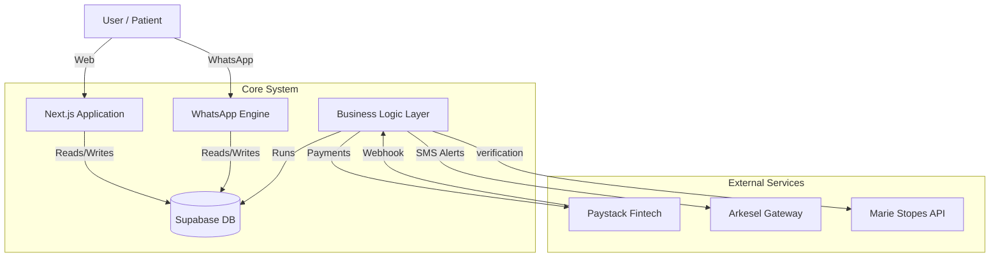

# System Architecture Overview

## High-Level Topology

DiscreetKit operates on a modern, **Serverless Event-Driven Architecture**. This design minimizes maintenance overhead while maximizing scalability, allowing the platform to handle spikes in traffic (e.g., promotional campaigns) without infrastructure provisioning.

### 1. The "Three-Pillar" Monorepo
The application is structured as a **Monorepo** (Single Repository) housing three distinct applications that share a common kernel (`src/lib`).

| Component | Audience | Tech Profile |
| :--- | :--- | :--- |
| **Consumer Storefront** | Public Users | Next.js App Router, SSR for SEO, Framer Motion for high-fidelity UI. Optimized for conversion. |
| **Admin Command Center** | Internal Ops | Real-time data visualization, Role-Based Access Control (RBAC), Global Inventory Management. |
| **Pharmacy Portal** | B2B Partners | Focused on operational efficiency. Real-time order polling, simplified inventory interface. |

### 2. Backend & Data Layer (Supabase)
We utilize **Supabase** as a Backend-as-a-Service (BaaS) wrapper around **PostgreSQL**.
*   **Database:** Relational data model (PostgreSQL) enforcing strict referential integrity between Orders, Products, and Pharmacy nodes.
*   **Auth:** Integrated Authentication handling JWT tokens for secure session management across web and mobile.
*   **Edge Functions:** Server-side logic runs on the Edge (Vercel Network) for low-latency responses globally.

### 3. Integration Grid
The system acts as a central hub connecting specialized external services:

## Key Architectural Decisions

### A. Centralized vs. Distributed Inventory
The system implements a **Hybrid Inventory Model**:
1.  **Global Catalogue:** Defined centrally by Admins.
2.  **Local Availability:** Each Pharmacy node has its own stock table (`pharmacy_products`).
3.  **Aggregation:** The user sees a "Virtual Global Stock" which is the sum of all available partner stocks. This allows for essentially infinite horizontal scaling of inventory without centralized warehousing.

### B. Headless Commerce (WhatsApp)
The WhatsApp integration is architected as a **Headless Client**. It consumes the same database APIs as the web frontend but renders the UI via WhatsApp's interactive message protocols (Lists, Buttons).
*   **Benefit:** Zero data duplication. A price change in the Admin dashboard instantly reflects on the Website AND WhatsApp.

### C. Security & Compliance
*   **RLS (Row Level Security):** Database policies prevent data leaks at the engine level. A Pharmacy user *physically cannot* query orders belonging to another pharmacy, even if the API code were compromised.
*   **Strict Typing:** The entire stack is written in **TypeScript**, providing compile-time guarantees against runtime errors, crucial for handling health-related transactions.
