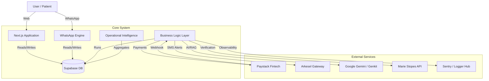
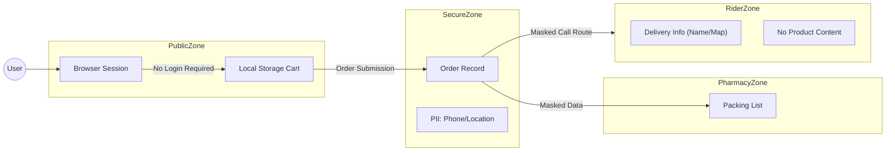

## April 2026 Overhaul ("Streaming Matrix" Sprint)

### 0. Streaming-First Architecture (The New Standard)

Following the April 2026 performance sprint, the platform has transitioned from a client-side data fetching model to a **Server-Side Streaming Architecture**:
- **Mechanism**: The UI is now composed of granular Server Components wrapped in React `Suspense` boundaries.
- **Progressive Hydration**: The page shell (navigation, layout) renders instantly, while data-heavy metrics, charts, and rankings are streamed into the browser in parallel as they complete.
- **Performance Impact**: Achieved a **sub-second Largest Contentful Paint (LCP)** for the entire Admin and Pharmacy ecosystem.

### 0.1 Unified GHS Financial Schema

To eliminate settlement discrepancies and ensure 100% auditability, we have standardized on the **`_ghs` Financial Schema**:
- **Source of Truth**: All financial columns (e.g., `total_price_ghs`, `subtotal_ghs`) are now the primary drivers for both Paystack settlement and Admin analytics.
- **Consistency Matrix**: All three pillars (WhatsApp, Website, Admin) now utilize the same mathematical kernel for tax, delivery, and discount calculations.

### 2. Optimistic UI Engine (Logistics Speed)
- **Impact**: Reduces "operator fatigue" and ensures the logistics chain moves at the speed of the user's intent.

### 3. Headless WhatsApp Commerce Agent ($85,000 Value)
The platform features a fully-realized **Headless Client** operating entirely within the WhatsApp ecosystem:
- **State-Machine Architecture**: Utilizing Redis for sub-500ms session persistence, allowing users to browse, order, and pay without a browser.
- **Transactional Reliability**: Securely integrated with Paystack's initialization and webhook verification layers for zero-friction mobile commerce.
- **Event-Driven Tracking**: Real-time push notifications for order status transitions directly to the user's personal messaging hub.

### 4. Clinical Partner Hub Layer ($45,500 Asset)
A specialized operational mode for hospitals (Hubs) to manage chronic medication at scale:
- **Token Verification Queue**: A clinical-grade interface for batch-approving hospital-issued refill codes.
- **Adherence Intelligence**: Monitoring of UNAIDS 95-95-95 metrics (on-time refills vs. clinical defaults).
- **Zero-PII Secure Fulfillment**: Decouples clinical authorization from delivery logistics, ensuring hospital-grade privacy.

### 5. Site-Wide Observability & Audit Infrastructure ($35,000 Value)
A unified, structured monitoring layer integrated across all platform portals (Admin, Pharmacy, Client):
- **Trace-Flow Propagation**: Every server action and API request is injected with a unique `traceId`, enabling instant root-cause analysis across distributed services.
- **Compliance Audit Trail**: Provides a non-repudiable logs of all critical medical fulfillment actions, fulfilling healthcare regulatory requirements.
- **Proactive Webhook Health**: Dedicated log stratification for Paystack and WhatsApp callback corridors to catch silent failures before they impact the P&L.

---

## March 2026 Architecture Enhancements

### Operational Intelligence Layer (NEW)
A purpose-built analytics layer added to the Admin Command Center, derived entirely from the existing data infrastructure:

- **Fulfillment Velocity Engine:** Aggregates `order_events` to compute the average time between `received` and `out_for_delivery` per order. Expressed in hours. Serves as the "Anxiety Meter" — the North Star KPI for trust operations.
- **Anonymity Density Aggregator:** Groups `orders` by `delivery_area` field, returning top 8 regions by volume. Renders as an Area chart in the Admin dashboard for geographic demand intelligence.
- **Operational Pulse Feed:** Extracts the latest 12 `order_events` from the 20 most recent orders, sorted by timestamp. Rendered as a monospaced real-time ticker in the admin UI using existing SSE infrastructure.

**System Design Principle:** Zero additional database tables, zero extra API calls, zero new dependencies. All three modules derive from the same `orders` + `order_events` payload already fetched by `getDashboardStats`.

### Premium Consumer Checkout Architecture (NEW)
- `order-form.tsx` refactored into a **2-Step Progressive Disclosure** pattern:
  - **Step 1 — Delivery:** Region selector, meeting-point picker, collapsible drop-off notes, GPS campus auto-detect (Haversine formula, <5km radius to nearest campus node).
  - **Step 2 — Contact & Summary:** Email, masked phone, order summary review, Paystack redirect CTA.
- **Framer Motion `AnimatePresence`** with `mode="wait"` for smooth horizontal slide transitions between steps.
- Hidden form fields maintain server action compatibility (`cartItems`, `subtotal`, `deliveryFee`, `totalPrice`) across both steps.
- Server validation errors on Step 1 fields auto-revert the user to Step 1.

### RankingList Visualization Upgrade (NEW)
- Relative performance bars: each row renders a `position: absolute` background div with `width = (item_value / max_value) * 100%`. Max value derived client-side from the items array using regex-based numeric extraction.
- Insight badges: `TOP` for rank 0, `VELOCITY` for products with value >70% of the list maximum (rank > 0 only).
- Hover state: left `w-0.5` primary accent bar appears on `group-hover`.

---

## Scheduled Jobs Architecture (2026-02 update)

- Workflows:
    - 15-minute cron — operational tasks: escalation checks and releasing expired inventory reservations.
    - Daily reconcile — payments verification batch at 05:00 UTC.
- Runtime hardening:
    - Concurrency guards to prevent overlapping runs.
    - Three-attempt retry with backoff for network/transient errors.
    - Secret validation and `curl` availability checks at job start.
- API contracts:
    - Escalations: `Authorization: Bearer <CRON_SECRET>`.
    - Release reservations: `Authorization: Bearer <CRON_SECRET>` or `x-vercel-cron`.
    - Reconcile: `x-cron-key: <CRON_SECRET>`.
    - Admin SMS test: bearer auth; sends to `ADMIN_PHONES`.

# System Architecture Overview

## High-Level Topology

DiscreetKit operates on a modern, **Serverless Event-Driven Architecture**. This design minimizes maintenance overhead while maximizing scalability, allowing the platform to handle spikes in traffic (e.g., promotional campaigns) without infrastructure provisioning.

### 1. The "Three-Pillar" Monorepo

The application is structured as a **Monorepo** (Single Repository) housing three distinct applications that share a common kernel (`src/lib`).

| Component                      | Audience     | Tech Profile                                                                                        |
| :----------------------------- | :----------- | :-------------------------------------------------------------------------------------------------- |
| **Consumer Storefront**  | Public Users | Next.js 16 (App Router), SSR for SEO, Framer Motion for high-fidelity UI. 2-step premium checkout. |
| **Admin Command Center** | Internal Ops | Operational Intelligence Layer: Fulfillment Velocity, Privacy Density, Live Pulse. RBAC + FAANG analytics. |
| **Pharmacy Portal**      | B2B Partners | Operational efficiency focus: real-time order polling, rider dispatch, simplified inventory interface. |

### 2. Backend & Data Layer (Supabase)

We utilize **Supabase** as a Backend-as-a-Service (BaaS) wrapper around **PostgreSQL**.

* **Database:** Relational data model (PostgreSQL) enforcing strict referential integrity between Orders, Products, and Pharmacy nodes.
* **Auth:** Integrated Authentication handling JWT tokens for secure session management across web and mobile.
* **Edge Functions & Server Actions:** Server-side logic runs on the Edge (Vercel Network) for low-latency responses globally.
* **Caching:** Short-TTL Redis cache layer (`cache:pharmacies:list`, `cache:pharmacy:{id}:products`, `cache:pharmacy:{id}:analytics`) with explicit invalidation on writes.

### 3. Integration Grid

The system acts as a central hub connecting specialized external services:

## Key Architectural Decisions

### A. Centralized vs. Distributed Inventory

The system implements a **Hybrid Inventory Model**:

1. **Global Catalogue:** Defined centrally by Admins.
2. **Local Availability:** Each Pharmacy node has its own stock table (`pharmacy_products`).
3. **Rider Registry:** Each Pharmacy node manages its own fleet of riders (`pharmacy_riders`), creating a decentralized logistics mesh.
4. **Aggregation:** The user sees a "Virtual Global Stock" which is the sum of all available partner stocks. This allows for essentially infinite horizontal scaling of inventory without centralized warehousing.

### C. Hub-and-Spoke Logistics Model (NEW — April 2026)

Unlike the standard pharmacy node model, the Refill System uses a **Hub-and-Spoke** architecture:
1.  **The Hub (Hospital)**: Acts as the clinical authority. Issues unique Refill Tokens to stable patients.
2.  **The Spoke (Logistics Layer)**: DiscreetKit riders receive "Masked Fulfillment" requests.
3.  **The End-Point (Patient)**: Receives medication anonymously at their home/office via token-to-token validation.

*Benefit:* Zero medical data leaves the hospital's clinical boundary, while 100% of the logistics burden is offloaded to DiscreetKit.

### D. Headless Commerce (WhatsApp)

The WhatsApp integration is architected as a **Headless Client**. It consumes the same database APIs as the web frontend but renders the UI via WhatsApp's interactive message protocols (Lists, Buttons).

* **Benefit:** Zero data duplication. A price change in the Admin dashboard instantly reflects on the Website AND WhatsApp.

### C. Operational Intelligence (NEW — March 2026)

A zero-cost analytics layer derived purely from existing data:

* **Fulfillment Velocity:** `AVG(out_for_delivery_at - received_at)` per order, computed in the `getDashboardStats` server action. Derived from `order_events` with Redis-backed caching.
* **Privacy Density:** `GROUP BY delivery_area` on `orders`, rendered as an Area chart. Drives geographic node expansion strategy.
* **Live Pulse:** Sorted `order_events` stream; integrated with a lightweight SSE-to-Server bridge for real-time dashboard reactivity.

### D. Security & Compliance

* **RLS (Row Level Security):** Database policies prevent data leaks at the engine level. A Pharmacy user *physically cannot* query orders belonging to another pharmacy, even if the API code were compromised.
* **Strict Typing:** The entire stack is written in **TypeScript**, providing compile-time guarantees against runtime errors, crucial for handling health-related transactions.
* **Idempotency:** Order status updates are idempotent; unchanged transitions do not resend SMS or create duplicate `order_events`.

## Data Privacy & Anonymity Architecture

A core value proposition is "Structural Privacy". We don't just promise privacy; we architect for it.

### Privacy Enforcements

1. **Identity/Content Decoupling:** The Pharmacy knows *what* to pack but not *who* it's for. The Rider knows *where* to go but not *what* they are carrying (plain packaging).
2. **No Accounts:** Users are identified by ephemeral Browser IDs or Order Codes, eliminating the risk of "Account Breach" leaking history.
3. **Data Minimization:** We only request phone numbers for delivery coordination. We do not store ages, medical history, or ID card numbers.

## February 2026 Architecture Enhancements

### Observability & Telemetry
- Sentry integrated into the pharmacy orders API for status transitions and notification attempts; exceptions captured for rapid diagnostics.

### Tenant Isolation & Server Authority
- RLS policies confirmed for `orders` (SELECT) and fully defined for `pharmacy_riders` (SELECT/INSERT/UPDATE/DELETE). Optional `orders` UPDATE policy available when enabling client-side writes via anon key.
- Server-side ownership checks ensure pharmacists can only mutate riders/orders belonging to their pharmacy, reducing blast radius if a client is compromised.

### Idempotency & Event Hygiene
- Order status updates are idempotent; unchanged transitions do not resend SMS.
- `order_events` entries deduplicated on unchanged statuses to keep audit trails clean and analytics accurate.
