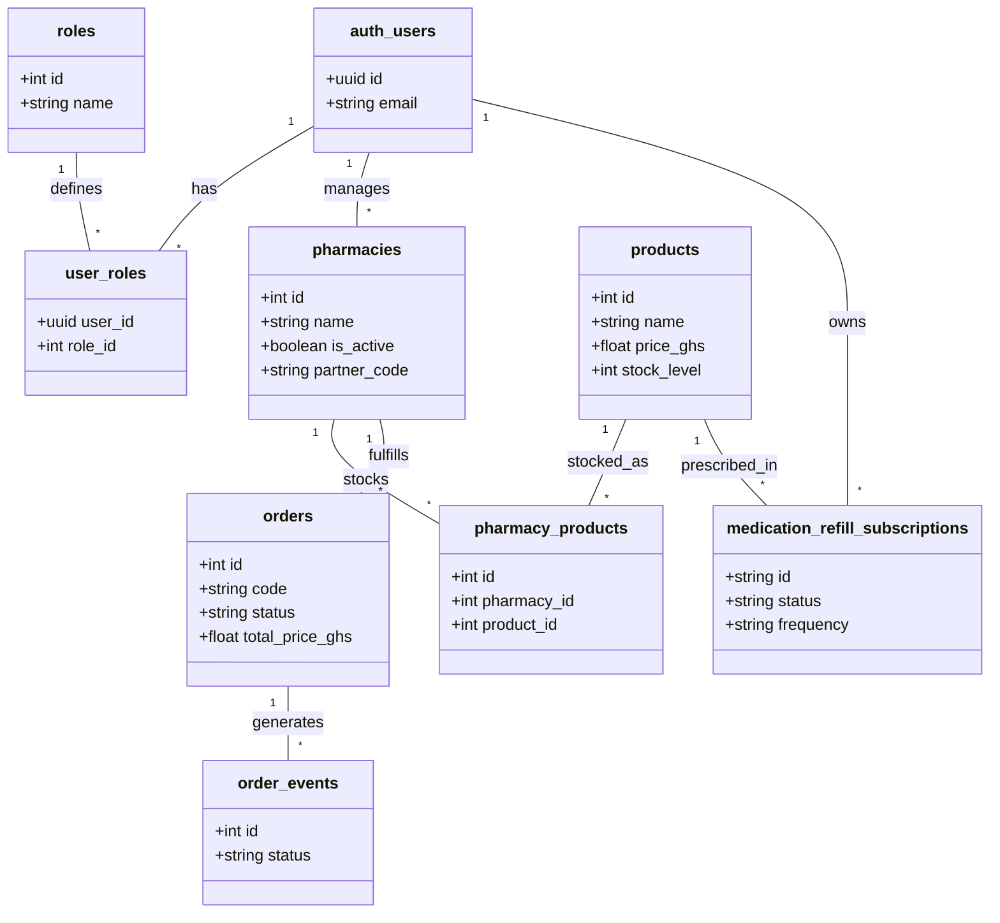

# DiscreetKit — Entity-Relationship Diagram (ERD)
**Document:** DIAGRAM-01  
**Version:** 1.0  
**Last Updated:** May 2026  
**Series:** Developer Reference Manual

This diagram illustrates the core database entities, their primary attributes, and the relationships between them based on the consolidated schema.

