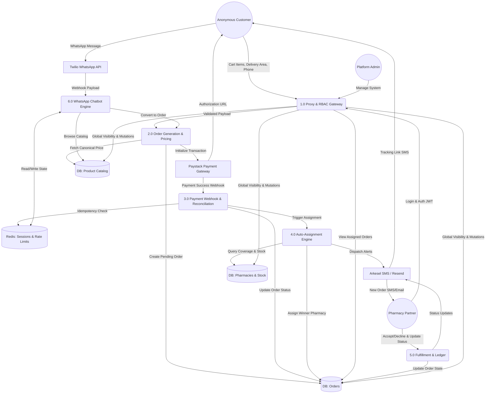

# DiscreetKit — Data Flow Diagram (DFD)
**Document:** DIAGRAM-02  
**Version:** 1.0  
**Last Updated:** May 2026  
**Series:** Developer Reference Manual

This Level 1 Data Flow Diagram illustrates how information moves between the external entities, the application processes, and the data stores within the DiscreetKit platform.

