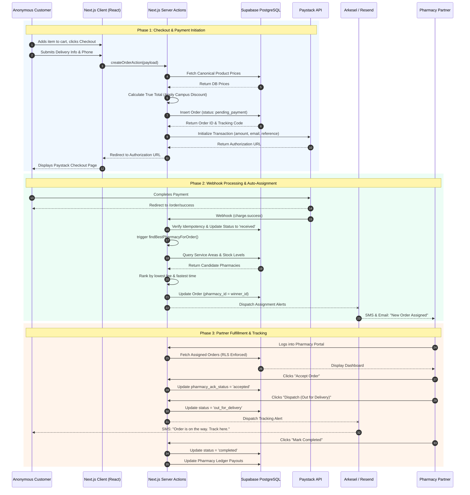

# DiscreetKit — Core Fulfillment Sequence Diagram
**Document:** DIAGRAM-03  
**Version:** 1.0  
**Last Updated:** May 2026  
**Series:** Developer Reference Manual

This sequence diagram details the step-by-step interactions between the client, the server, third-party APIs, and the fulfillment partner during a standard order lifecycle.

