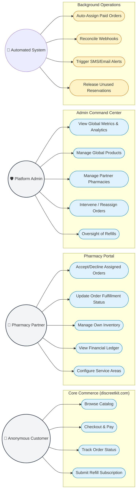

# DiscreetKit — Use Case Diagram
**Document:** DIAGRAM-04  
**Version:** 1.0  
**Last Updated:** May 2026  
**Series:** Developer Reference Manual

This diagram maps the high-level capabilities of each primary actor interacting with the DiscreetKit platform.

